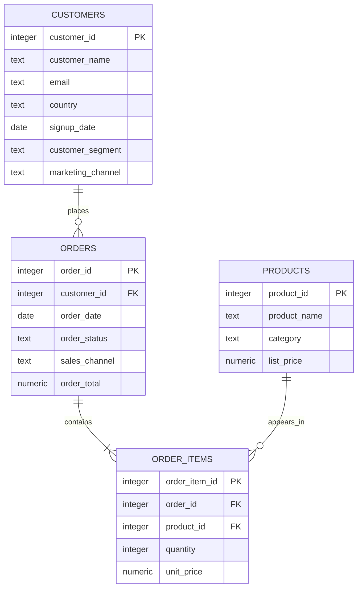

# Signal Store schema

## Grain

| Table | One row represents |
|---|---|
| `customers` | One registered customer |
| `orders` | One order placed by one customer |
| `order_items` | One product line within one order |
| `products` | One sellable product |

`orders.order_total` is stored so part one can query a single table. The seed
script calculates it from `order_items`, and the validation script proves the two
totals match.
